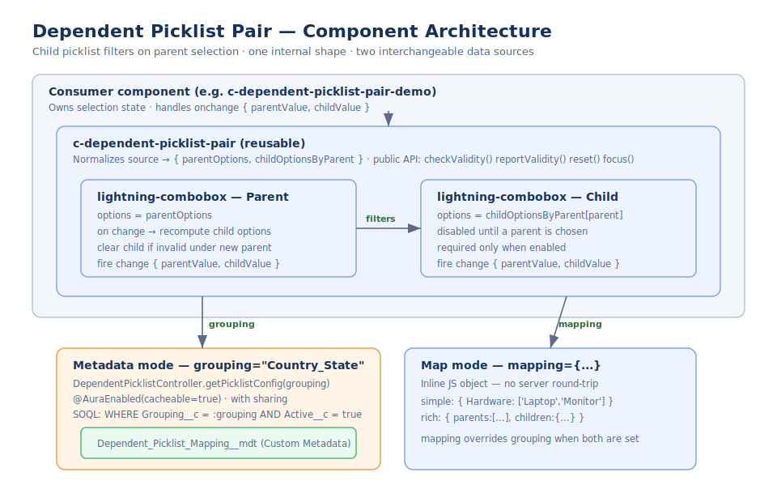

# Dependent Picklist Pair — Reusable Lightning Web Component

A domain-agnostic **parent → child picklist pair** for Salesforce. Selecting a
value in the parent combobox filters the options available in the child
combobox. The option set can be sourced two ways — **Custom Metadata** (admin
configurable, cacheable, deployable between orgs) or an **inline JS map** (zero
server round-trip) — and the component behaves identically either way.



---

## Features

- 🔗 **Parent-driven filtering** — the child list is always scoped to the selected parent.
- 🗂️ **Two interchangeable data sources** — Custom Metadata (`grouping`) *or* a JS map (`mapping`). `mapping` overrides `grouping`.
- 🧹 **Self-healing selection** — a child value that is invalid under a newly chosen parent is cleared automatically, so an impossible pair is never emitted.
- ✅ **Validation API** — `checkValidity()` / `reportValidity()` cover both comboboxes in one call; supports `required`.
- 🎛️ **Imperative API** — `reset()`, `focus()`, and a combined `value` accessor.
- 📣 **One event** — `change` with `{ parentValue, childValue }`.
- 🧩 **Drop-in for Lightning App Builder** — exposed with configurable properties.
- 🔒 **Best-practice Apex** — `with sharing`, `@AuraEnabled(cacheable=true)`, and `AuraHandledException`.

---

## Project structure

```
force-app/main/default/
├── classes/
│   ├── DependentPicklistController.cls        # cacheable Apex over the CMDT
│   └── DependentPicklistControllerTest.cls    # Apex unit tests
├── customMetadata/                            # sample Country_State records
│   └── Dependent_Picklist_Mapping.Country_State_*.md-meta.xml
├── objects/
│   └── Dependent_Picklist_Mapping__mdt/       # the Custom Metadata Type + fields
└── lwc/
    ├── dependentPicklistPair/                 # ← the reusable component
    └── dependentPicklistPairDemo/             # example consumer (both sources)
```

The reusable building block is **`dependentPicklistPair`**.
`dependentPicklistPairDemo` + the sample metadata are an example you can delete
once you have your own consumer.

---

## Quick start

### Option A — Custom Metadata source

1. Deploy the `Dependent_Picklist_Mapping__mdt` type and your rows (sample
   `Country_State` rows are included).
2. Point the component at the grouping:

```html
<c-dependent-picklist-pair
    grouping="Country_State"
    parent-label="Country"
    child-label="State / Province"
    required
    onchange={handleChange}
></c-dependent-picklist-pair>
```

```js
handleChange(event) {
    const { parentValue, childValue } = event.detail; // e.g. { US, CA }
}
```

### Option B — JS map source (no server call)

```html
<c-dependent-picklist-pair
    mapping={categoryMap}
    parent-label="Category"
    child-label="Subcategory"
    onchange={handleChange}
></c-dependent-picklist-pair>
```

```js
// Simple shape: parent value -> array of child values (labels default to values)
categoryMap = {
    Hardware: ['Laptop', 'Monitor', 'Keyboard'],
    Software: ['CRM', 'ERP', 'Analytics']
};

// Rich shape: explicit labels for parents and children
categoryMap = {
    parents: [{ label: 'Hardware', value: 'HW' }],
    children: { HW: [{ label: 'Laptop', value: 'LAPTOP' }] }
};
```

---

## API reference

### Attributes

| Attribute | Type | Default | Description |
| --- | --- | --- | --- |
| `grouping` | String | — | `Dependent_Picklist_Mapping__mdt.Grouping__c` value; enables **metadata mode**. |
| `mapping` | Object | — | Inline JS map; enables **map mode**. Overrides `grouping`. |
| `parent-label` | String | `Parent` | Label for the parent combobox. |
| `child-label` | String | `Child` | Label for the child combobox. |
| `parent-placeholder` | String | `Select an option` | Parent placeholder. |
| `child-placeholder` | String | `Select an option` | Child placeholder (before a parent is chosen, prompts to pick the parent first). |
| `required` | Boolean | `false` | Marks both comboboxes required for validation. |
| `disabled` | Boolean | `false` | Disables both comboboxes. |
| `parent-value` | String | — | Get/set the selected parent value. |
| `child-value` | String | — | Get/set the selected child value. |
| `value` | Object | — | Combined accessor: `{ parentValue, childValue }`. |

### Methods

| Method | Returns | Description |
| --- | --- | --- |
| `checkValidity()` | `Boolean` | `true` if both comboboxes are valid (no UI change). |
| `reportValidity()` | `Boolean` | Validates both comboboxes and displays messages. |
| `reset()` | `void` | Clears both selections. |
| `focus()` | `void` | Moves focus to the parent combobox. |

### Events

| Event | `event.detail` | Fired when |
| --- | --- | --- |
| `change` | `{ parentValue, childValue }` | Either combobox selection changes. |

---

## The Custom Metadata Type

`Dependent_Picklist_Mapping__mdt` — one row per parent → child pairing.

| Field | Type | Purpose |
| --- | --- | --- |
| `Grouping__c` | Text (required) | Names the picklist pair (e.g. `Country_State`). The component filters on this. |
| `Parent_Value__c` | Text (required) | Stored value of the parent option (carried in events). |
| `Parent_Label__c` | Text | Parent display label (falls back to the value). |
| `Child_Value__c` | Text (required) | Stored value of the child option. |
| `Child_Label__c` | Text | Child display label (falls back to the value). |
| `Sort_Order__c` | Number | Optional ordering hint (lower first). |
| `Active__c` | Checkbox (default `true`) | Only active rows are returned. |

A single type can drive many independent pairs — just use a different
`Grouping__c` per pair (e.g. `Country_State`, `Product_Category`).

---

## Design notes

- **One normalized internal shape.** Both sources are reduced to
  `{ parentOptions, childOptionsByParent }`, so render and validation logic never
  branch on where the data came from. Adding a third source (e.g. a real
  dependent picklist via the UI API) is one normalization function.
- **`cacheable=true` over Custom Metadata.** Option sets are configuration, not
  transactional data — cacheable reads are fast and safe, and CMDT deploys
  cleanly across orgs.
- **Self-healing pairs.** Changing the parent revalidates the current child
  against the new parent's options and clears it if incompatible, so the
  component can never emit an impossible combination.

See [docs/ARCHITECTURE.md](docs/ARCHITECTURE.md) for diagrams and the full
rationale.

---

## Testing

This project has **no npm / Node tooling** — everything runs on-platform through
the Salesforce CLI.

```bash
# Run the Apex unit tests in your org / scratch org
sf apex run test --class-names DependentPicklistControllerTest --result-format human --wait 10
```

- **Apex** — `DependentPicklistControllerTest` covers distinct-parent grouping,
  blank/unknown groupings, and label fallback (Custom Metadata is visible to
  tests without `SeeAllData`).
- **LWC** — validate the component interactively: deploy it, drop
  `c-dependent-picklist-pair-demo` on a Lightning App/Home page, and exercise both
  the Custom Metadata and JS-map pairs (select a parent, confirm the child list
  filters, use **Validate** / **Reset**).

> If you later want automated LWC unit tests, add the
> [`@salesforce/sfdx-lwc-jest`](https://github.com/salesforce/sfdx-lwc-jest)
> tooling back with `npm init`. It is intentionally omitted here to keep the
> project dependency-free.

---

## Deployment

```bash
sf project deploy start --source-dir force-app
```

Requires the `Dependent_Picklist_Mapping__mdt` type and at least one active row
per grouping (or use map mode and skip the metadata entirely).

---

## Requirements

- Salesforce API **62.0**
- Salesforce CLI (`sf`) — no npm / Node dependency
