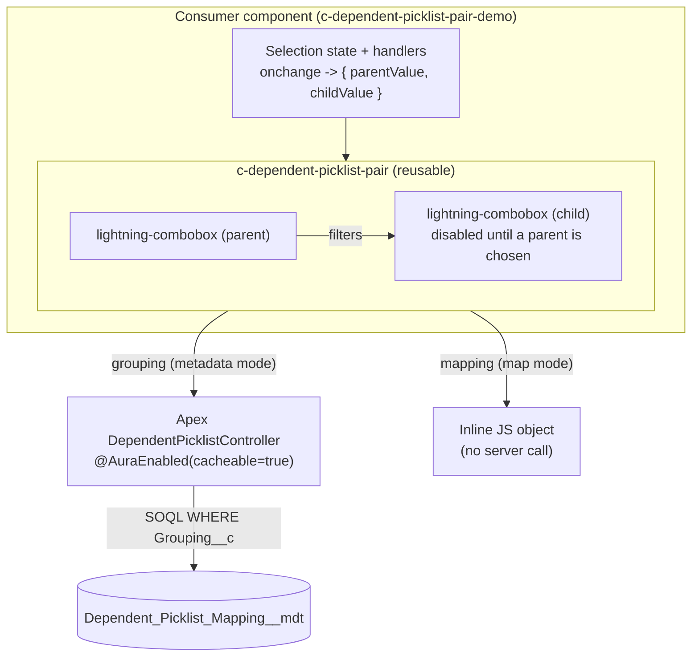
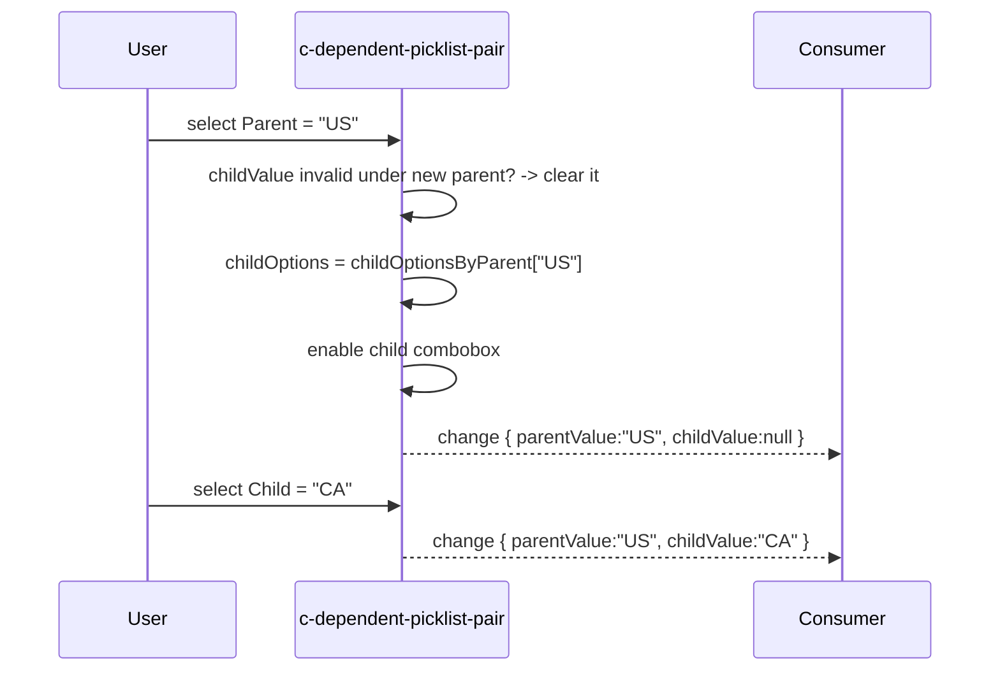

# Architecture — Dependent Picklist Pair

A rendered diagram is available at [architecture.svg](architecture.svg). The
Mermaid sources below are the maintainable version of the same picture.

## 1. Component & data-source composition

The component is agnostic to where its options come from. A consumer picks
**one** of two sources: Custom Metadata (server, cacheable) or a JS map
(client, no round-trip). `mapping` always wins over `grouping`.



## 2. Normalization — one internal shape, two sources

Both sources are collapsed into a single internal shape so the render logic
never branches on source:

```
{ parentOptions: [{ label, value }],
  childOptionsByParent: { <parentValue>: [{ label, value }] } }
```

```mermaid
flowchart LR
    A["grouping set?"] -->|yes, no mapping| B["getPicklistConfig(grouping)"]
    B --> N["normalized config"]
    C["mapping set?"] -->|simple map<br/>{ parent: [child] }| D["_normalizeMap"]
    C -->|rich map<br/>{ parents, children }| D
    D --> N
    N --> R["parentOptions -> parent combobox<br/>childOptionsByParent[parent] -> child combobox"]
```

## 3. Selection & filtering flow



## Design rationale

| Decision | Why |
| --- | --- |
| **Two interchangeable sources (CMDT / JS map)** | Config-as-data (admin-editable, deployable) *or* zero-latency inline data — the consumer chooses without the component changing. |
| **Single normalized internal shape** | Render and validation logic stay source-agnostic; adding a third source later is one `_normalize*` function. |
| **`cacheable=true` Apex over Custom Metadata** | Option sets are configuration, not transactional data — cacheable reads are fast and safe, and CMDT deploys between orgs. |
| **Child auto-clears on incompatible parent change** | Prevents an impossible parent/child combination from ever being emitted. |
| **`mapping` overrides `grouping`** | A consumer supplying its own data never triggers a wasted server call. |
| **Public imperative API** (`checkValidity` / `reportValidity` / `reset` / `focus`) | Lets a parent form drive validation and reset, and enables unit testing. |
| **`change` event contract** `{ parentValue, childValue }` | Domain-agnostic payload; the consumer maps it onto whatever fields it owns. |
| **`with sharing` + `AuraHandledException`** | Runs in the user's context and never leaks a raw stack trace to the client. |
